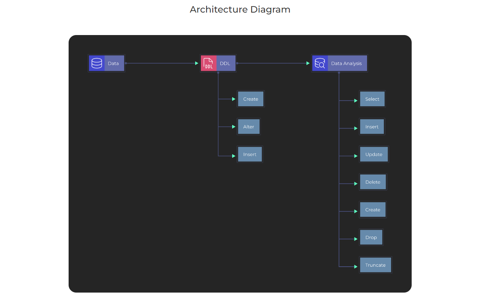
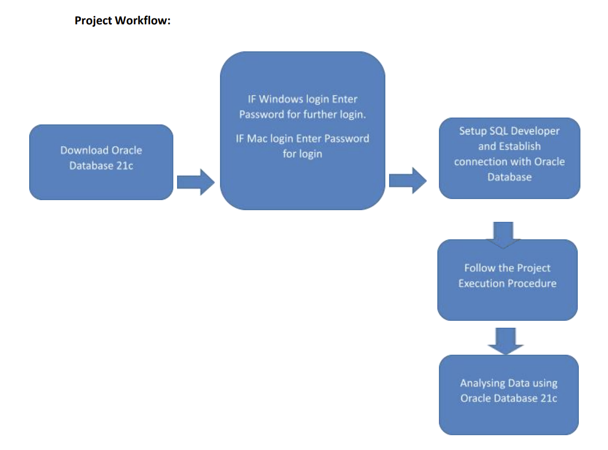

# SQL-Data-Analysis-Part-1
SQL Project for Data Analysis using Oracle Database

# Project Description

### What is Dataset Analysis?

Dataset Analysis is defined as manipulating or processing unstructured data or raw data to draw valuable insights and conclusions that will help derive critical decisions that will add some business value. The dataset analysis process is followed by organizing the dataset, transforming the dataset, visualizing the dataset, and finally modeling the dataset to derive predictions for solving the business problems, making informed decisions, and effectively planning for the future.

 

### Data Pipeline: 

It refers to a system for moving data from one system to another. The data may or may not be transformed, and it may be processed in real-time (or streaming) instead of batches. A data pipeline is extracting or capturing data using various tools, storing raw data, cleaning, validating data, transforming data into a query-worthy format, visualization of KPIs including Orchestration of the above process is data pipeline.

 

### What is the Agenda of the project?

The project’s Agenda involves Analyzing the data using SQL on the Oracle Database Software. We first download the Oracle Database 21c edition from the official Oracle website and understand the problem. Then a Password is set up for the “SYSTEM” username during the setup of Oracle Database 21c software. Then SQL Plus is used to connect to Oracle Database using the same credentials of the Oracle Database 21c. 

Further, a Database connection is established from SQL Developer to the Oracle Database using the “SYSTEM” username and the password. Then tables are created in the database followed by data insertion into tables and exploration, i.e., noticing relationships between tables, walking through the columns, and seeing comments. Records are displayed in an ordered manner, handling NULL values, and selecting records based on patterns like Wildcard, Operators, etc. Then working on Data Manipulation commands(DML) for Data Analysis. Then taking Backup of the Table where migration is going on and use COMMIT and ROLLBACK commands. Then listing down distinct records, further renaming columns, and finally, listing down employee details based on the complex nested conditions.

### Technology Used

● Database - Oracle

● Scripting language - SQL

● Tools - Oracle SQL Developer

### Dataset Used

Hers is the DDL commands: [DDL.sql](https://github.com/Raghuraj-DataEngineer/SQL-Data-Analysis-Part-1/blob/main/DDL.sql)

Here is the Data Analysis queries:

[Data_Analysis_Part_1.sql](https://github.com/Raghuraj-DataEngineer/SQL-Data-Analysis-Part-1/blob/main/Data_Analysis_Part_1.sql)

[Data_Analysis_Part_2.sql](https://github.com/Raghuraj-DataEngineer/SQL-Data-Analysis-Part-1/blob/main/Data_Analysis_Part_2.sql)

### Key Takeaways

● Understanding the project and how to use Oracle Database 21c

● Understanding the basics of data analysis, SQL commands, and their application

● Working on DML commands and listing employee details based on complex nested conditions

● Introduction to Oracle SQL Developer

● Usage of Oracle SQL Developer and connecting it to Oracle Database

● Creating tables and Inserting data into them

● Exploring tables and understanding the relationship between them

● Listing Employees and Departments based on some conditions

● Displaying recordsin an ordered manner using DESC keyword

● Handling NULL values and understanding them

● Selecting records based on some patternslike operators etc

● Working on DML commandsfor analysis

● Creating a backup of the table where migration is going on

● Executing COMMIT and ROLLBACK commands

● Listing DISTINCT recordsfor analysis

● Renaming the column for better analysis

● Listing down employee details based on complex nested conditions

### Data Analysis:

● The Oracle Database 21c is downloaded from the Oracle website for SQL Data analysis. 

● The SQL Developer is downloaded for working in Oracle databases, connecting it to the
“SYSTEM” username and creating tables in the database. 

● Data isinserted into the tables, followed by the exploration of the tables, including a
walkthrough of columns and seeing comments. 

● The listing of the Employees and Departments is done based on some conditions using the
SQL commands followed by displaying the records in an ordered manner and handling of the
NULL values. 

● The selection of the records is made based on some patterns like Wildcard, Operators, etc
followed by implementation of the Data Manipulation commands(DML) like Add, Update and
Delete for the Data Analysis. 

● The backup of the table where migration is going on is taken, followed by COMMIT and
ROLLBACK commands. Then the listing of distinct records is done, and further renaming of
the columns. 

● Finally, a listing of the employee details based on the complex nested conditions is done
